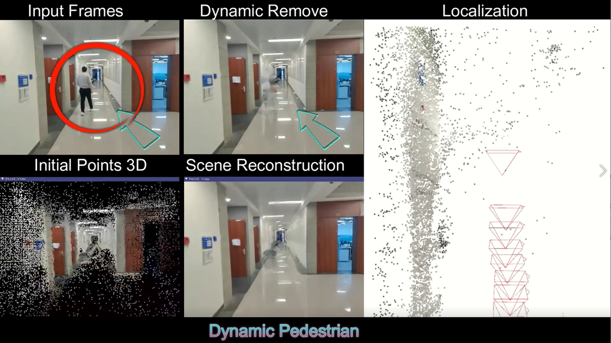

# TDGM-SLAM: A Robust Two-Stage Dynamic SLAM with Guided Motion Segmentation

## Video Demos

https://github.com/user-attachments/assets/8059c9eb-dde0-4a50-9709-0c01377156c8

https://github.com/user-attachments/assets/982eca29-ac20-4153-8190-9a82030b242c

## Overview

This repository provides supplementary materials showcasing real-world experiments as outlined in Section 4.4 of the Main Text. The demonstration videos, captured using handheld smartphones, highlight the capabilities of TDM-SLAM in challenging environments.

## Explanation

### Demo Details

**Demo 1**:  
Recorded in an indoor setting—a long corridor with varying lighting and dynamic pedestrians.

**Demo 2**:  
Captured on an outdoor road, featuring complex dynamic scenes with moving vehicles and pedestrians.

### Video Analysis

- **Input Frames vs. Dynamic Remove**:  
  The upper part of the demo videos compares key frames ("Input Frames") with frames after dynamic region removal ("Dynamic Remove"). Dynamic regions are identified using TDM-SLAM's motion segmentation, enhancing scene clarity.

- **Initial Points 3D and Scene Reconstruction**:  
  The lower section showcases 3D point cloud maps ("Initial Points 3D") and their rendering into a final 3D Gaussian scene model ("Scene Reconstruction"), visualized using the SIBR viewer.

- **Localization**:  
  On the right side, "Localization" demonstrates TDM-SLAM's real-time camera pose estimation and map point construction, emphasizing accuracy and robustness in dynamic environments.

Throughout the demonstrations, key moments are highlighted with informative prompts, providing insights into TDM-SLAM's operation and performance.

